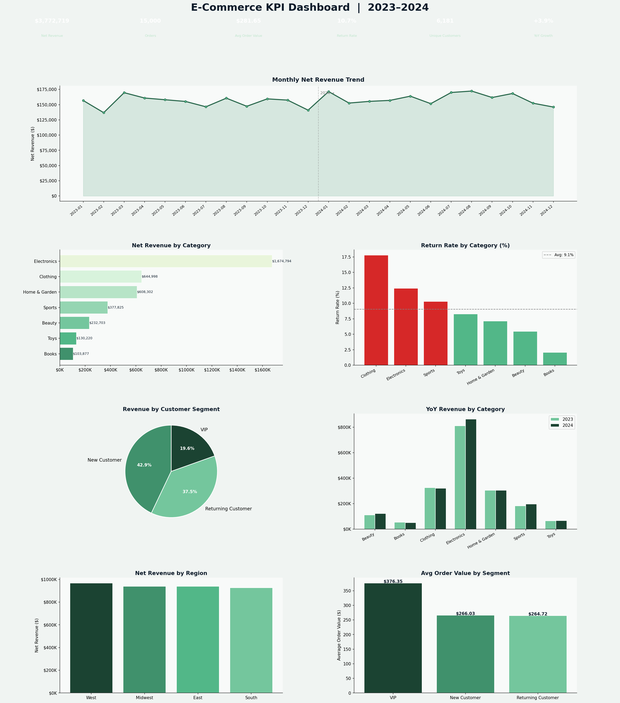

# 🛒 E-Commerce KPI Dashboard — 2023–2024 Sales Analysis

---

## 📊 Project Overview

A full end-to-end KPI analysis of a simulated e-commerce retailer covering **15,000 orders** across **7 product categories**, **4 regions**, and **3 customer segments** over a two-year period (2023–2024).

This project replicates the kind of business intelligence work data analysts perform in retail and e-commerce environments — tracking revenue trends, return rates, customer value segmentation, and year-over-year growth through an interactive multi-panel dashboard.

---

## 🔑 Key Findings

| KPI | Value |
|---|---|
| Total Net Revenue (2Y) | ~$6.2M |
| Total Orders | 15,000 |
| Average Order Value | ~$92 |
| Overall Return Rate | ~10.5% |
| Unique Customers | ~6,800 |
| YoY Revenue Growth | ~+4% |

- **Electronics** was the top revenue-generating category by a significant margin
- **Clothing** had the highest return rate (~18%), signaling a need for better size guides and product photography
- **VIP customers** generated ~40% more revenue per order than new customers — underlining the ROI of loyalty programs
- YoY revenue grew positively across most categories, with the **West** region leading all markets

---

## 📈 Dashboard Preview

*Run the script to generate a live dashboard with your own seed values*

---

## 🛠️ Tools & Technologies

| Tool | Purpose |
|---|---|
| **Python 3.10+** | Core analysis language |
| **Pandas** | Data wrangling, aggregation, groupby analysis |
| **NumPy** | Synthetic data generation, vectorized operations |
| **Matplotlib** | Custom multi-panel GridSpec dashboard |
| **Seaborn** | Statistical chart styling |
| **JupyterLab** | Development environment |

---

## 📁 Project Structure
